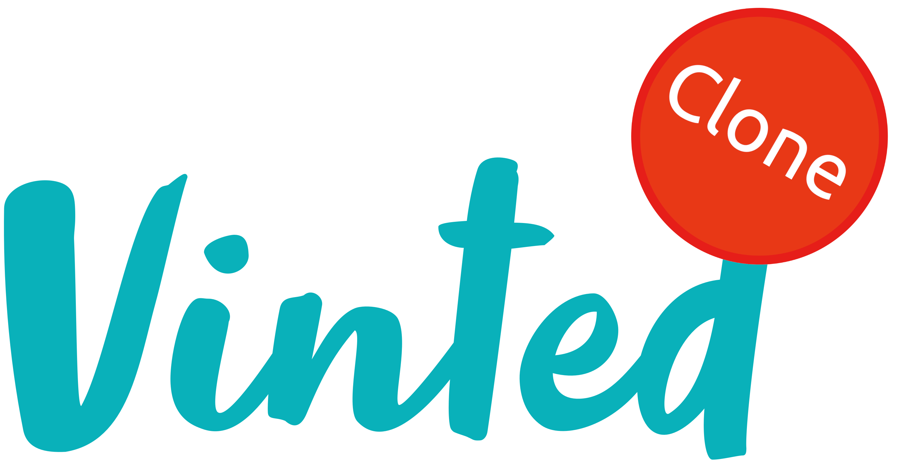
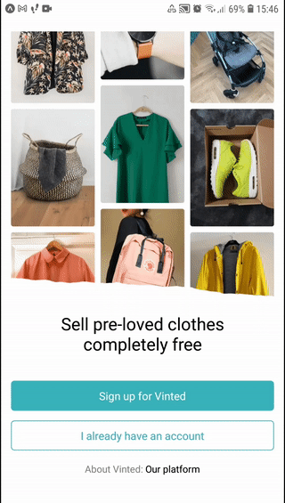
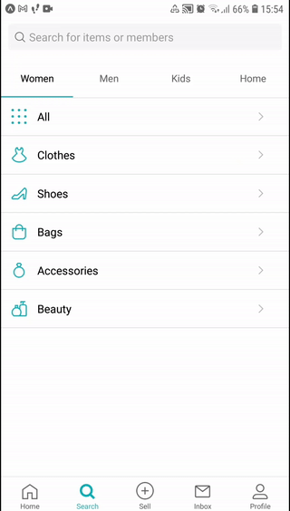
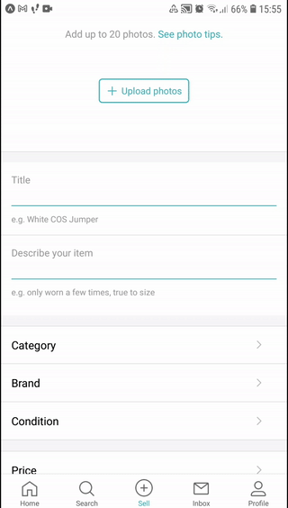
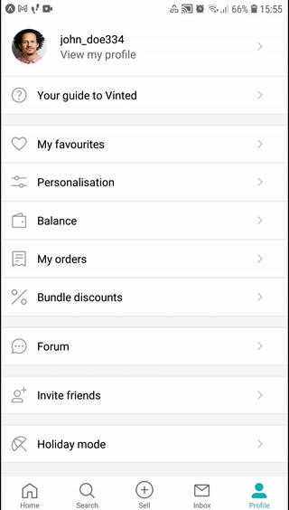

#

## This project is a React Native frontend oriented clone of the famous Vinted mobile application

I've created this project as proof of my frontend skills with limited time and packages required, only resorting to installing navigation and tab packages in order to shorten time spent on the project and obtain better, more efficient results. This way, I was able to take care of most of the important and common parts of the Vinted app's frontend.

## Test it yourself !

	<Text>Flash this QR code with the expo app !</Text>

	

This project's expo page is available through this link: <https://expo.dev/@persiaangelino/vinted-react-native>

## Previews

    

## Install with yarn

The package manager **[yarn](https://classic.yarnpkg.com/lang/en/)** is required to run this project locally:

-   Install the project's dependencies with `yarn install`
-   Run the app with `yarn start`

## Want to contribute ?

If you'd like to add your own part to this project, feel free to create a pull request with your addition !

## Reporting bugs

If you find a bug, please report it by [opening an issue](https://github.com/angelinopersia/vinted-react-native/issues/new)!

## Suggestions

If you have any ideas or suggestions to make this clone better and more convincing, I'd be grateful to know!

## Star★ my project

If my project helped you and/or if you liked, please star★ it, I'd appreciate it!
